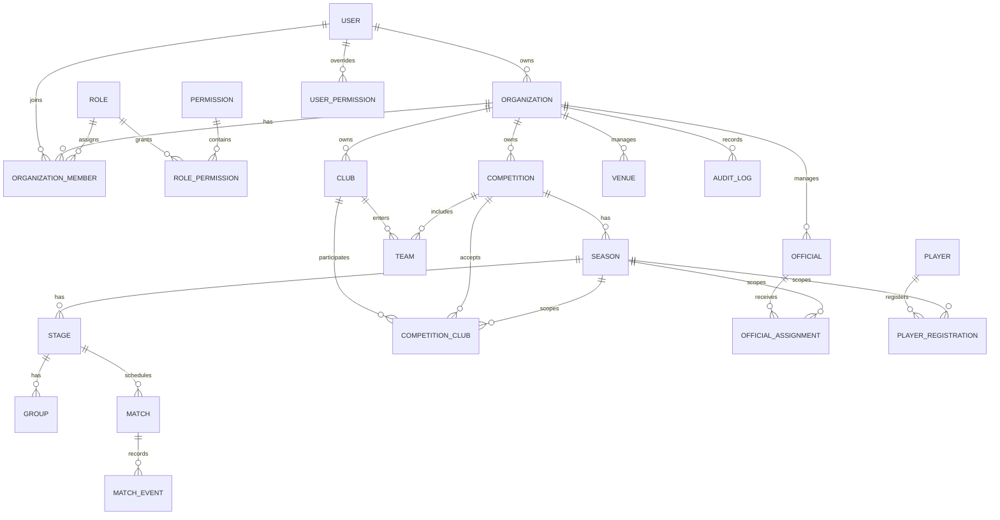

# Entity relationship overview

The Prisma schema is the detailed, executable data model. Additional operational tables listed in the master specification are introduced in the phase that owns their invariants rather than as inert tables in Phase 0.
